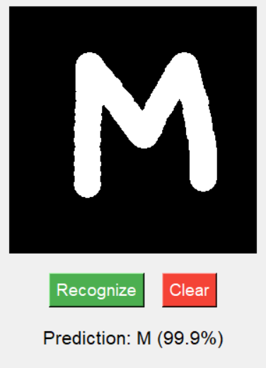
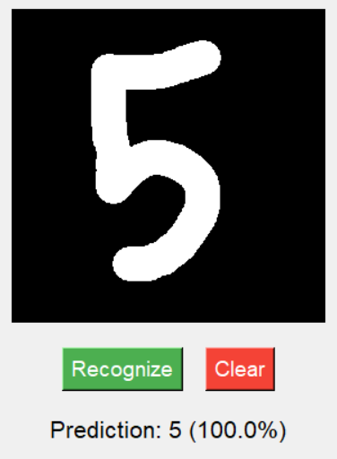

AI Handwritten Character Recognition ✍️

This project is a graphical application that utilizes a Convolutional Neural Network (CNN) to recognize handwritten digits and letters in real-time. It was developed to demonstrate proficiency in Computer Vision and Deep Learning pipelines.

📸 Demo

### Letter Recognition

### Digit Recognition

🧠 How It Works (Architecture)

The model was trained on the EMNIST (Extended MNIST) dataset, specifically the "Balanced" split, covering 47 classes (digits 0-9 and letters A-Z).

Model Architecture:

Input Layer: 28x28 Grayscale images.

Conv2D Layers: Two convolutional layers (32 & 64 filters) to extract spatial features (edges, curves).

MaxPooling: Down-sampling to reduce dimensionality and computational cost.

Dropout (0.5): Regularization technique to prevent overfitting.

Output Layer: Dense layer with Softmax activation for 47-class classification.

Test Accuracy: ~88-90%.

🛠 Tech Stack

Language: Python

ML Framework: TensorFlow / Keras

Data Processing: NumPy, TensorFlow Datasets

GUI: Tkinter

Image Processing: PIL (Pillow)

🚀 Installation & Usage

Clone the repository:

git clone [https://github.com/JasurCodeAI/NeuralWriter.git](https://github.com/JasurCodeAI/NeuralWriter.git)

Install dependencies:

pip install -r requirements.txt

Run the application:

python app.py

👨‍💻 Author

Developed by Jasur Abilkhairov.
Passionate about Artificial Intelligence and Computer Vision.

